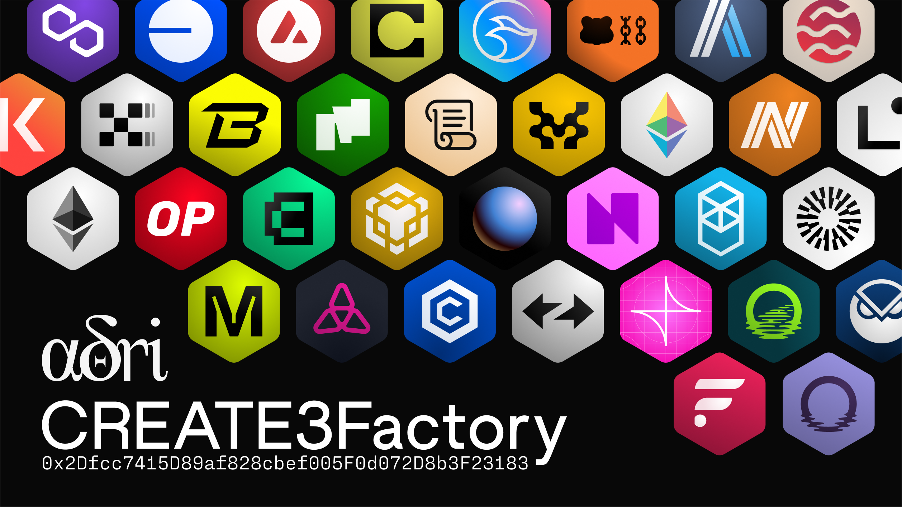

# CREATE3Factory

Factory contract for easily deploying contracts to the same address on multiple chains, using CREATE3.

This was forked from https://github.com/lifinance/create3-factory (which forked https://github.com/zeframlou/create3-factory).

The deploy script was updated to use legacy (non EIP-1559) transactions due to the fact that some chains do not support EIP-1559.

## Why?

Deploying a contract to multiple chains with the same address is annoying. One usually would create a new Ethereum account, seed it with enough tokens to pay for gas on every chain, and then deploy the contract naively. This relies on the fact that the new account's nonce is synced on all the chains, therefore resulting in the same contract address.
However, deployment is often a complex process that involves several transactions (e.g. for initialization), which means it's easy for nonces to fall out of sync and make it forever impossible to deploy the contract at the desired address.

One could use a `CREATE2` factory that deterministically deploys contracts to an address that's unrelated to the deployer's nonce, but the address is still related to the hash of the contract's creation code. This means if you wanted to use different constructor parameters on different chains, the deployed contracts will have different addresses.

A `CREATE3` factory offers the best solution: the address of the deployed contract is determined by only the deployer address and the salt. This makes it far easier to deploy contracts to multiple chains at the same addresses.

CREATE3 allows us to manage our deployments better as well as make integration by developers more painless.

Reach out to us at [@aori_io](https://twitter.com/aori_io) on Twitter if you would like us to deploy the `CREATE3Factory` to a certain chain.

## Deployments

`CREATE3Factory` has been deployed by the deployer address `0x243Eac06A13b3d83d0310fA320Dd9dF16147B08b` to `0x2Dfcc7415D89af828cbef005F0d072D8b3F23183` on the following networks:

### Mainnets
- [Ethereum Mainnet](https://etherscan.io/address/0x2Dfcc7415D89af828cbef005F0d072D8b3F23183)
- [Arbitrum Nova](https://nova.arbiscan.io/address/0x2Dfcc7415D89af828cbef005F0d072D8b3F23183)
- [Arbitrum (One)](https://arbiscan.io/address/0x2Dfcc7415D89af828cbef005F0d072D8b3F23183)
- [Avalanche](https://avascan.info/blockchain/c/address/0x2Dfcc7415D89af828cbef005F0d072D8b3F23183/contract)
- [Base](https://base.blockscout.com/address/0x2Dfcc7415D89af828cbef005F0d072D8b3F23183)
- [Binance Smart Chain](https://bscscan.com/address/0x2Dfcc7415D89af828cbef005F0d072D8b3F23183)
- [Blast](https://blastscan.io/address/0x2Dfcc7415D89af828cbef005F0d072D8b3F23183)
- [Canto](https://canto.dex.guru/address/0x2Dfcc7415D89af828cbef005F0d072D8b3F23183)
- [Celo](https://celoscan.io/address/0x2Dfcc7415D89af828cbef005F0d072D8b3F23183)
- [Cronos](https://cronoscan.com/address/0x2Dfcc7415D89af828cbef005F0d072D8b3F23183)
- [Flare](https://flare-explorer.flare.network/address/0x2Dfcc7415D89af828cbef005F0d072D8b3F23183)*
- [Fantom](https://ftmscan.com/address/0x2Dfcc7415D89af828cbef005F0d072D8b3F23183)
- [Gnosis](https://gnosisscan.io/address/0x2Dfcc7415D89af828cbef005F0d072D8b3F23183)
- [HyperEVM](https://hyperevmscan.io/address/0x2Dfcc7415D89af828cbef005F0d072D8b3F23183)
- [Linea](https://lineascan.build/address/0x2dfcc7415d89af828cbef005f0d072d8b3f23183)
- [Kava](https://kavascan.com/address/0x2Dfcc7415D89af828cbef005F0d072D8b3F23183)
- [Klaytn](https://scope.klaytn.com/account/0x2dfcc7415d89af828cbef005f0d072d8b3f23183)*
- [Manta Pacific](https://pacific-explorer.manta.network/address/0x2Dfcc7415D89af828cbef005F0d072D8b3F23183)
- [Mantle](https://explorer.mantle.xyz/address/0x2Dfcc7415D89af828cbef005F0d072D8b3F23183)
- [Moonbeam](https://moonscan.io/address/0x2Dfcc7415D89af828cbef005F0d072D8b3F23183)
- [Moonriver](https://moonriver.moonscan.io/address/0x2Dfcc7415D89af828cbef005F0d072D8b3F23183)
- [OKXChain](https://www.okx.com/explorer/oktc/address/0x2dfcc7415d89af828cbef005f0d072d8b3f23183)
- [opBNB](https://opbnbscan.com/address/0x2Dfcc7415D89af828cbef005F0d072D8b3F23183)
- [Optimism](https://optimistic.etherscan.io/address/0x2dfcc7415d89af828cbef005f0d072d8b3f23183)
- [Plasma Mainnet](https://plasma.etherscan.io/address/0x2Dfcc7415D89af828cbef005F0d072D8b3F23183)
- [Polygon](https://polygonscan.com/address/0x2Dfcc7415D89af828cbef005F0d072D8b3F23183)
- [Polygon zkEVM](https://zkevm.polygonscan.com/address/0x2Dfcc7415D89af828cbef005F0d072D8b3F23183)
- [Pulsechain](https://scan.pulsechain.com/address/0x2Dfcc7415D89af828cbef005F0d072D8b3F23183)
- [Scroll](https://scrollscan.com/address/0x2Dfcc7415D89af828cbef005F0d072D8b3F23183)
- [Sonic Mainnet](https://sonicscan.org/address/0x2Dfcc7415D89af828cbef005F0d072D8b3F23183)
- [Unichain](https://uniscan.xyz/address/0x2Dfcc7415D89af828cbef005F0d072D8b3F23183)
- [X Layer](https://www.okx.com/web3/explorer/xlayer/address/0x2dfcc7415d89af828cbef005f0d072d8b3f23183)
- [ZKSync](https://explorer.zksync.io/address/0x2Dfcc7415D89af828cbef005F0d072D8b3F23183)
- [Zora](https://explorer.zora.energy/address/0x2Dfcc7415D89af828cbef005F0d072D8b3F23183)


<!-- - Ethereum
- Fantom
- Avalanche C-Chain
- FUSE
- Velas
- Harmony Shard 0
- EVMOS
- Aurora
- Boba -->

### Testnets

- [Arbitrum Goerli](https://goerli.arbiscan.io/address/0x2Dfcc7415D89af828cbef005F0d072D8b3F23183)
- [Arbitrum Sepolia](https://sepolia.arbiscan.io/address/0x2Dfcc7415D89af828cbef005F0d072D8b3F23183)
- [Arbitrum Stylus Testnet](https://stylus-testnet-explorer.arbitrum.io/address/0x2Dfcc7415D89af828cbef005F0d072D8b3F23183)
- [Artela Testnet](https://betanet-scan.artela.network/address/0x2Dfcc7415D89af828cbef005F0d072D8b3F23183)
- [Avalanche Fuji](https://testnet.snowtrace.io/address/0x2Dfcc7415D89af828cbef005F0d072D8b3F23183)
- [Base Goerli](https://goerli.basescan.org/address/0x2dfcc7415d89af828cbef005f0d072d8b3f23183)
- [Base Sepolia](https://sepolia.basescan.org/address/0x2dfcc7415d89af828cbef005f0d072d8b3f23183)
- [Berachain bArtio](https://artio.beratrail.io/address/0x2Dfcc7415D89af828cbef005F0d072D8b3F23183)
- [Blast Sepolia](https://testnet.blastscan.io/address/0x2Dfcc7415D89af828cbef005F0d072D8b3F23183)
- [BSC Testnet](https://testnet.bscscan.com/address/0x2Dfcc7415D89af828cbef005F0d072D8b3F23183)
- [Fantom Testnet](https://testnet.ftmscan.com/address/0x2Dfcc7415D89af828cbef005F0d072D8b3F23183)
- [Frame Testnet](https://explorer.testnet.frame.xyz/address/0x2Dfcc7415D89af828cbef005F0d072D8b3F23183)
- [Goerli](https://goerli.etherscan.io/address/0x2dfcc7415d89af828cbef005f0d072d8b3f23183)
- [Holesky](https://holesky.etherscan.io/address/0x2Dfcc7415D89af828cbef005F0d072D8b3F23183)
- [Linea Goerli](https://explorer.goerli.linea.build/address/0x2Dfcc7415D89af828cbef005F0d072D8b3F23183)
- [Mantle Testnet](https://explorer.testnet.mantle.xyz/address/0x2Dfcc7415D89af828cbef005F0d072D8b3F23183)
- [Mode Sepolia](https://sepolia.explorer.mode.network/address/0x2Dfcc7415D89af828cbef005F0d072D8b3F23183)
- [Morph Testnet](https://explorer-testnet.morphl2.io/address/0x2Dfcc7415D89af828cbef005F0d072D8b3F23183)
- Move M1 Devnet
- [Neon Devnet](https://devnet.neonscan.org/address/0x2Dfcc7415D89af828cbef005F0d072D8b3F23183)
- [opBNB Testnet](https://opbnb-testnet.bscscan.com/address/0x2Dfcc7415D89af828cbef005F0d072D8b3F23183)
- [Optimism Goerli](https://goerli-optimism.etherscan.io/address/0x2Dfcc7415D89af828cbef005F0d072D8b3F23183)
- [Optimism Sepolia](https://sepolia-optimism.etherscan.io/address/0x2Dfcc7415D89af828cbef005F0d072D8b3F23183)
- [Polygon Mumbai](https://mumbai.polygonscan.com/address/0x2Dfcc7415D89af828cbef005F0d072D8b3F23183)
- [Sei Devnet](https://blockchair.com/sei-evm/address/0x2Dfcc7415D89af828cbef005F0d072D8b3F23183)
- [Sepolia](https://sepolia.etherscan.io/address/0x2dfcc7415d89af828cbef005f0d072d8b3f23183)
- [Taiko Jolnir](https://explorer.jolnir.taiko.xyz/address/0x2Dfcc7415D89af828cbef005F0d072D8b3F23183)
- [Taiko Katla](https://explorer.katla.taiko.xyz/address/0x2Dfcc7415D89af828cbef005F0d072D8b3F23183)
- [Unichain Sepolia](https://sepolia.uniscan.xyz/address/0x2Dfcc7415D89af828cbef005F0d072D8b3F23183)
- [Camp Network Testnet V2](https://camp-network-testnet.blockscout.com/address/0x2Dfcc7415D89af828cbef005F0d072D8b3F23183)*

(* = Unable to Verify)
(** = Issues Deploying)

## Usage

Call `CREATE3Factory::deploy()` to deploy a contract and `CREATE3Factory::getDeployed()` to predict the deployment address, it's as simple as it gets.

A few notes:

- The salt provided is hashed together with the deployer address (i.e. msg.sender) to form the final salt, such that each deployer has its own namespace of deployed addresses.
- The deployed contract should be aware that `msg.sender` in the constructor will be the temporary proxy contract used by `CREATE3` rather than the deployer, so common patterns like `Ownable` should be modified to accomodate for this.

## Installation

To install with [Foundry](https://github.com/foundry-rs/foundry):

```
forge install aori-io/create3-factory
```

## Local development

This project uses [Foundry](https://github.com/foundry-rs/foundry) as the development framework.

### Dependencies

```bash
forge install
```

### Compilation

```bash
forge build
```

### Deployment

Make sure that the network is defined in foundry.toml, then run:

```bash
./deploy/deploy.sh [network]
```

### Fallback: Verification
Verifying a contract on the relevant block explorer can have its issues. You can run:

```bash
forge verify-contract 0x2Dfcc7415D89af828cbef005F0d072D8b3F23183 CREATE3Factory --watch --chain [network]
```

to verify the contract separately if such a fail occurs. In the worst case, you can run the following command to output the standard JSON input to `etherscan.json`:

```bash
forge verify-contract 0x2Dfcc7415D89af828cbef005F0d072D8b3F23183 CREATE3Factory --optimizer-runs=1000000 --show-standard-json-input > etherscan.json
```

### Fallback: Blockscout Verification

If Blockscout verification fails, use this command to verify the contract on Blockscout:

```bash
forge verify-contract \
    --rpc-url <rpc-endpoint> \
    0x2Dfcc7415D89af828cbef005F0d072D8b3F23183 \
    src/CREATE3Factory.sol:CREATE3Factory \
    --verifier blockscout \
    --verifier-url <blockscout_explorer_url>/api/ \
    --compiler-version 0.8.17
```